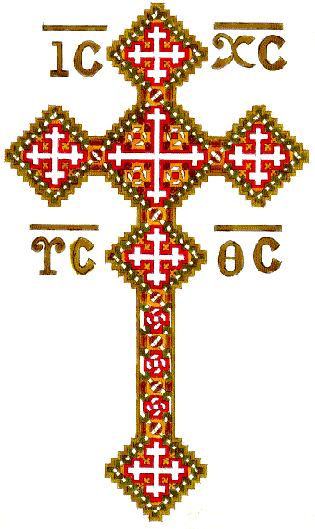
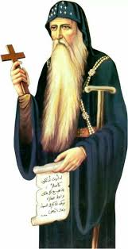
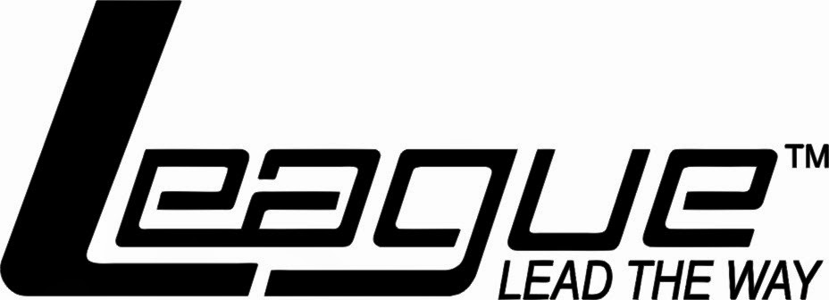
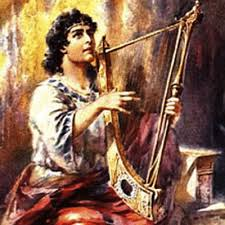

 
# بسم الاب والابن والروح القدس الاله الواحد امين

# كنيسة الانبا انطونيوس والشهيد جورجيوس بالمحلة الكبري
#                  خدمة اعدادي بنين

#                    Summer 2018

**This summer will be different and I am sure you will get the most available benefit.**

## _**Frist of all**_ 
* you have to make sure that you want to learn something new 
* nobody can help you to improve yourself 
* if you do not have the will to make something different you still a kid and it is your choice , may time change this in the future

* **I write in english because :-**
    * You are not a kid 
    * Google translate can help
    * It is a good chance to improve your language 
    * It is a begining to exit you comfort zone 
    * Please try to discover another side of the world 
    * Finally, this small difficulty will work like a filter for those do not have the desire or enough motivation to be different.

* **ترجمة اللي قلناه**
* انت لازم تتاكد انك عايز تتعلم حاجة جديدة
* مفيش اي حد هيقدر يساعدك تتطور نقسك
* لو انت مش جواك الارادة اللي تخليك عايز تعمل حاجة مختلفة , فده معناه انك لسة طفل صغير وده قرارك ويمكن مرور الزمن يغير ده جواك
* **انا كتبت بالانجليزي علشان**
    * انت مش طفل
    * ترجمة جوجل ممكن تساعدك تفهم اللي انت مش فاهمه
    * دي فرصة حلوة تطور الانجليزي بتاعك
    * دي بداية علشان تخرج برة حدود المألوف
    * من فضلك حاول تكتشف عالم اخر موازي غير اللي انت متعود عليه
    * في النهاية , الصعوبة البسيطة اللي انت انت هتواجهها علشان تترجم المكتوب هتبقي عاملة زي الفلتر اللي هيبين مين جواه ارادة يبقي مختلف ومين لا 

**note :** I hope this to be the last time to write in Arabic

## mahragan el keraza activities time table 

**event**|**day**|**time**
-------|---------|-------
2l7aaan | saturday  | 7:30 pm
2l7aaan | sunday    | 7:30 pm
2l7aaan | wednesday | 7:30 pm
bible study | tuesday | 7:30 pm
coptic language | soon | soon       
psalms | monday | 7:30 pm 
Revelation (سفر الرؤيا) | thursday | 7:30 pm

## AVVA-ANTONY-Prep  AAP LEAGUE 
* we are going to make a league integrated with our summer activites 
* every thing will be considered with points and at the end of this summer .... **surprise !**

### some vocablary you should know

**word** | **meaning**
----- | -----
vesper | عشية
Mass | قداس
psalmody | تسبحة
melody | لحن
psalm  | مزمور

### _**points distribution**_

**Activity** | **Points** 
-------|----------
football match win (whole team) |  3
football match draw (whole team) | 1 
Vespers | 2 
Mass (any day except friday) | 2
Psalmody (matin or vesper) | 2 
Any summer activity related to "mahragan el keraza" attendance | 2
Assignments | 2
Individual match award | 1 
Individual round award | 3
weekly big assignmet | 15
melody memorize | 10
psalm memorize | 5
friday sunday school | 3 
friday mass attendance | 3 
Bounus | infinity
one team attend mass/vesper togther | 3
three teams attend mass/vesper together | 10
five teams attend mass/vesper together | 15

### VERY IMPORTANT NOTES  
* Everything is related to your honesty. 
* I will believe you in whatever you say ,as we are not in a school but in a church ,please never forget this "we are in a church".
* It will not be good if I found that you are lying on me.
    * **frist time**  you will lose 0.25 of your points
    * **second time** you will lose 0.5 of your remainig points
    * **third time** you will lose all your points
* football is _not a must_ but you have the ability to choose another activity if you want
* activities like {art , music , programming , drawing , ..... etc }
* teams forming is a must 
* points will be updated every week 
* Your week points will not be added if you did not attend at least a mass and bible study each week
* In this page we will add assignments in all fields (bible studies , coptic language , melodies ...., etc ) 
* Individual match/round awards are like {"Top scorer" , "clean sheet" , "your attitude in the field" , ... etc }
* each one will have a secret nick name that you will use to send me assignmests solutions
* activities will be from monday till thursday from 5 pm to 6 pm
* there is no points for سفر الرؤيا

### AAP_League rules and how to get bounus  
* Each team consists of 5 players
* Each team will play 5-6 matches per a week
* match time is 15 min
* if the whole team -whole team is a must- attended together a mass or psalmody on any day except friday each member will get 3 points
* if three teams attended together a mass or psalmody on any day except friday each member will get 10 points
* if five teams attended together a mass or psalmody on any day except friday each member will get 15 points 
* if one member of a team did not attended this mass no one of his team will get bounus points
* for a team that decided to attend a mass together must share this AAP group on facebook and let me know that to share this with your friends and confirm your attend to get your bounus , if you did not share this ; sorry you will not get  your bounus
* communication between us can be done through our [facebook group](https://www.facebook.com/groups/679935588874918/?ref=bookmarks)

### Basic google templates
* [suggestion](https://docs.google.com/forms/d/e/1FAIpQLSeXAr9VHtrlUd57GYuYVmTBCmUgTbetNKUTAGncNR1tFmlaTg/viewform?usp=sf_link)
* [disadvantage](https://goo.gl/forms/DHXwUvGMln0nUtWx1)
* [what you attended](https://goo.gl/forms/MUGF9NohhOkT2WDE3)

### Assignments 
* **week #1**
    * [assignment1](https://goo.gl/forms/p3WH1NtNzdGtlS0N2)

* **week #2**
    * [assignment2](https://goo.gl/forms/KN2MrRvwTqLiTkBy2) 
    * [assignment2.1](https://goo.gl/forms/OxNThjzAb5pghvpt1)

## الحان الكرازة 2018

[play list](https://www.youtube.com/watch?v=owl5IStzeh4&list=PLv-Yb7Hc3mDj0-POizJrPPF95Ja6wbBmO)

### الهيتنيات 

### الهوس الثاني

### التوزيع السنوي

### الهوس الرابع

### افلوجيمينوس الصغير

### تي شوري الحزايني الصغير

## This week points  

**wwe are sorry as the last week there was no bible study** 

**thanks _bemen boshra_ for your suggestion**

**#**| **name** | **Points**
----|-------|------
01 | jan fady | 29
02 | phillimon adel |29
03 | kyrollos samuel | 26
04 | pola ayman | 24
05 | kyrollos samy| 24
06 | freddy fady | 22
07 | youlious ramzy| 20
08 | mario atef |19
09 | mark adel | 12
10 | mark rizkalla| 8
11 | beshoy samuel | 6
12 | mina rizkalla| 6
13 | abanoub nagy | 0 
14 | mina essam  | 0
15 | fady nader | 0
16 | peter sabry | 0
17 | mina hany | 0
18 | abanoub tamer henen | 0 
19 | mina mohsen| 0
20 | abanoub tamer |0
21 | andrew emad| 0
22 | maged nasser| 0
23 | kyrollos maher | 0
24 | mina medhat | 0
25 | tony ramy| 0
26 | john ramzy | 0
27 | bemen boshra | 0
28 | kyrollos nader | 0
29 | malak mekhael | 0
30 | joseph sadek | 0
31 | kariem john | 0

## The overall Table points

**#**| **name** | **Points** | **up/down** 
----|-------|------ | --------
01 | kyrollos samuel | 74 | -- 
02 | phillimon adel |64 | up
03 | kyrollos samy| 62 | down
04 | jan fady | 63 | up
05 | pola ayman |58 | down
06 | youlious ramzy| 46 | up
07 | mario atef |45 | --
08 | freddy fady |38 | up
09 | mark adel | 30 | up
10 | abanoub nagy |28 | down
11 | mark rizkalla|26 | down
12 | mina rizkalla| 24 |  down
13 | bemen boshra |16 | down
14 | fady nader |16 |  --
15 | mina mohsen| 14 | --
16 | mina essam  | 13 | --
17 | peter sabry | 12 | --
18 | mina hany |11 | --
19 | abanoub tamer henen | 8 | --
20 | abanoub tamer |0 | --
21 | andrew emad| 0 | --
22 | maged nasser| 0 | --
23 | kyrollos maher | 0 | --
24 | mina medhat | 0 | --
25 | tony ramy| 0 | --
26 | john ramzy | 0 | --
27 | beshoy samuel | 0 | --
28 | kyrollos nader | 0 | --
29 | malak mekhael | 0 | --
30 | joseph sadek | 0 |--
31 | kariem john | 0 |--

## Best team for this week 

**team** **#** **?????**

## TEAMS 

#### team 1 
* Bemen Boshra  
* Mark Rizkalla 
* Mina Riskalla 
* John Ramzy
* Mina Mohsen
* Andrew Emad

#### team 2 
* Abanoub Tamer Henin
* Pola Ayman
* Mario Atef 
* Keyrollos Samy
* Freddy Fady

#### team 3 
* youlious Ramzy
* Keyrollos Samuel
* Phillimon Adel
* Mina Essam
* Fady Nader

#### team 4 
* Abanoub Tamer 
* Jan fady
* Mark Adel
* Beshoy Samuel
* Keyrollos Nader

#### team 5 
* Peter Sabry
* Abanoub Nagy
* Mina Hany
* Malaak Mekhael
* Joseph Sadek

#### team 6 
* Mina Medhat
* Maged Nasser
* Keyrollos Maher
* Anton Ramy
* Kariem John

#### END
**I hope our lord Jesus Christ use this work to praise his name and use us to help his children**
* contact me 
    * email : peteremad97@hotmail.com
    * mobile number  _**WhatsApp**_ : +21222965445
* copyright©PeterEmadSalah
